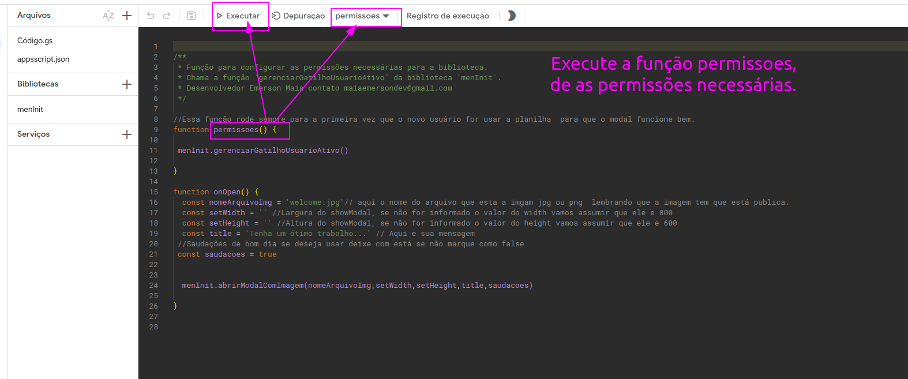
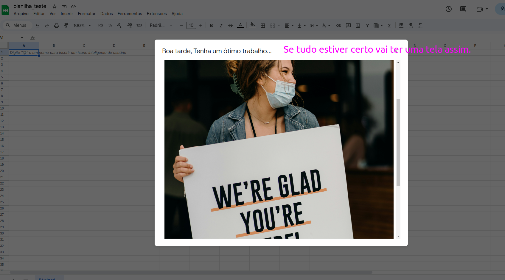

# 🖼️ showModalDialog Ao Abrir a planilha 🚀

[](#)
[](#)
[](#)
[](#)
[](#)
[](#)
[](https://opensource.org/licenses/MIT)


Biblioteca para exibir imagens do Google Drive em modais personalizados no Google Sheets.

## ✨ Destaques

- **Fácil integração:** Adicione a biblioteca ao seu projeto Apps Script com o Clasp.
- **Com duas funções:** `permissoes` / `onOpen`.
- **Configure:** `nomeArquivoImg` - `setWidth setHeight` -  `title` - `saudacoes`.

## 🛠️ Tecnologias

- Google Apps Script
- Clasp
- VSCode
- Prettier

## 🚀 Como usar

1. No Editor do Apps Script, em "Bibliotecas", cole o ID da biblioteca (`17Xi4SigorbUxebXhlPeHow3UxSU7_gFH3evtVDZaFxRs9QtWljxL5D1G`).

<div align="center">

</div>

2. Copie e cole o código abaixo no editor do App Script.

```javascript
function permissoes() {
function permissoes() {
  menInit.gerenciarGatilhoUsuarioAtivo();
}

function onOpen() {
  const nomeArquivoImg = 'welcome.jpg'; // Nome do arquivo da imagem (jpg ou png), que deve estar pública.
  const setWidth = ''; // Largura do showModal (opcional, padrão: 800)
  const setHeight = ''; // Altura do showModal (opcional, padrão: 600)
  const title = 'Tenha um ótimo trabalho...'; 
  const saudacoes = true; // Exibir saudações (opcional, padrão: true)

  menInit.abrirModalComImagem(nomeArquivoImg, setWidth, setHeight, title, saudacoes);
}
```
3. Execute a função `permissoes()`.

<div align="center">

</div>

4. Atualize a planilha (F5) ou abra-a novamente.
Se tudo correu bem, sua planilha exibirá o modal ao abrir.
<div align="center">

</div>

 ## 🤝 Contribuições são bem-vindas!

 Este projeto é de código aberto e sua colaboração é muito apreciada! Se você tiver alguma ideia, sugestão de melhoria, correção de bugs ou qualquer outra contribuição, sinta-se à vontade para abrir uma issue ou enviar um pull request.

Juntos, podemos tornar esta biblioteca ainda mais útil e completa para a comunidade! 😊

